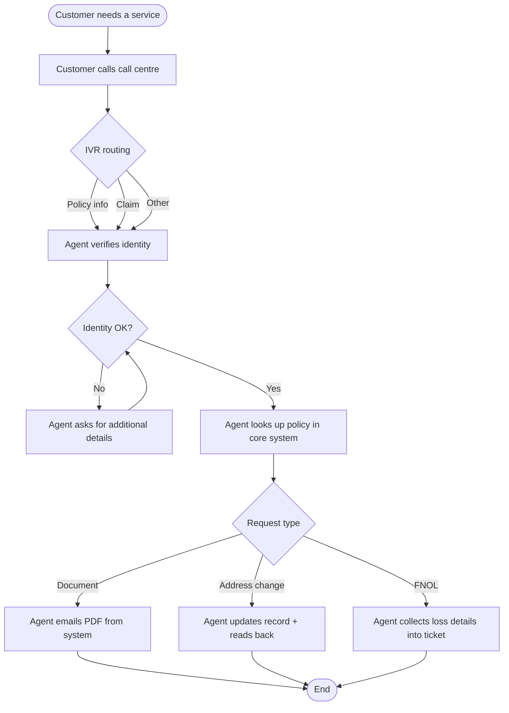

# As-is: Service request via phone

**Pain points observed:**
- Identity verification consumes ~50% of average call time.
- Agents copy policy data manually between systems.
- Document delivery by email is delayed by mail-server queues.
