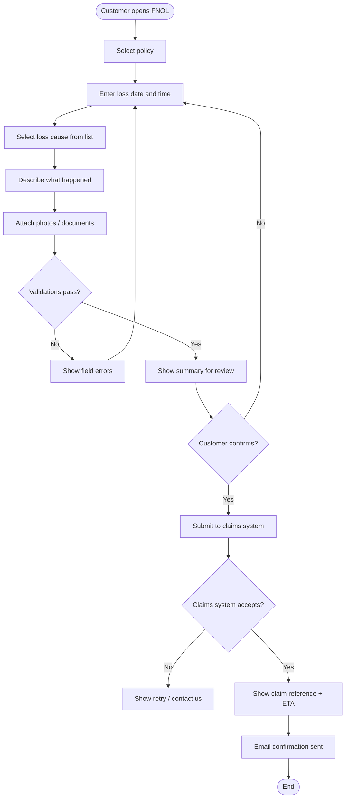

# FNOL — First Notice of Loss

**Notes:**
- Maximum 10 attachments, 10 MB each (see SRS F-09).
- Loss-cause list is sourced from the claims system to keep parity.
- On submission failure the draft is saved locally so the customer can
  retry without re-entering data.
