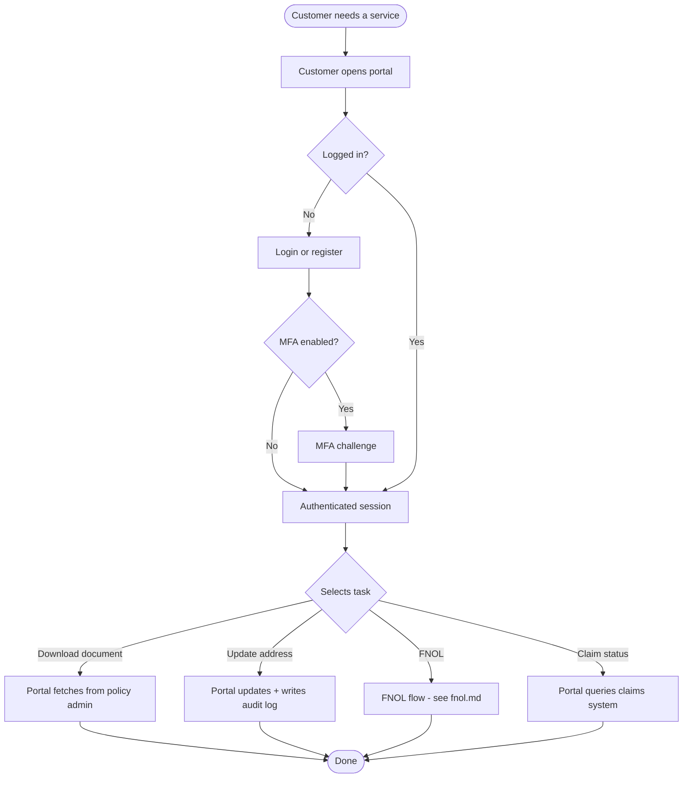

# To-be: Service request via portal

**Expected effects:**
- Identity verified once at login (with optional MFA).
- Documents available in seconds, not minutes.
- Audit trail captured automatically for every change.
